# Masinlar.az Car Listings Analysis

Data analysis and visualization of car listings scraped from masinlar.az (Azerbaijan's car marketplace).

## Dataset Overview

| Metric | Value |
|--------|-------|
| **Total Listings** | 55 |
| **Data Source** | masinlar.az |
| **Collection Date** | December 2025 |

---

## Key Insights & Findings

### Price Analysis

| Statistic | Value |
|-----------|-------|
| **Average Price** | 19,194 AZN |
| **Median Price** | 16,700 AZN |
| **Minimum Price** | 900 AZN |
| **Maximum Price** | 135,000 AZN |

**Key Finding:** The median price (16,700 AZN) is lower than the average (19,194 AZN), indicating the presence of high-value luxury vehicles skewing the average upward.

### Top Brands

| Rank | Brand | Listings |
|------|-------|----------|
| 1 | Chevrolet | 6 |
| 2 | LADA (VAZ) | 4 |
| 3 | Mercedes | 4 |
| 4 | BYD | 4 |
| 5 | Toyota | 4 |

**Key Finding:** Chevrolet dominates the market with budget-friendly models like Cobalt, Cruze, and Aveo. BYD's strong presence indicates growing interest in Chinese electric/hybrid vehicles.

### Most Expensive Brands (Average Price)

| Brand | Average Price (AZN) |
|-------|---------------------|
| Maserati | 135,000 |
| Mercedes | 20,000+ |
| BMW | 16,000+ |
| Porsche | 21,500 |

**Key Finding:** Maserati leads as the most expensive brand with a single high-value listing (Levante 2021).

### Vehicle Age Analysis

| Metric | Value |
|--------|-------|
| **Average Year** | 2010 |
| **Oldest Vehicle** | 1991 |
| **Newest Vehicle** | 2024-2025 |

**Key Finding:** The market shows a mix of older budget vehicles (1990s-2000s) and newer models (2023-2025), with 2025 BYD models showing strong presence in new listings.

### Mileage Statistics

| Statistic | Value |
|-----------|-------|
| **Average Mileage** | 200,613 km |
| **Median Mileage** | 205,708 km |

**Key Finding:** Most vehicles have high mileage (200,000+ km), typical for a used car market dominated by budget-friendly options.

### Geographic Distribution

| City | Percentage |
|------|------------|
| Baku (Baki) | ~80% |
| Sumqayit | ~5% |
| Ganca | ~3% |
| Other regions | ~12% |

**Key Finding:** Baku dominates the market as expected, being the capital and largest city of Azerbaijan.

### Fuel Type Distribution

| Fuel Type | Share |
|-----------|-------|
| Benzin (Gasoline) | ~65% |
| Plug-in Hybrid | ~15% |
| Dizel (Diesel) | ~12% |
| Hibrid (Hybrid) | ~5% |
| Other | ~3% |

**Key Finding:** While gasoline vehicles dominate, there's notable growth in plug-in hybrids (BYD models), reflecting global EV trends reaching Azerbaijan.

### Transmission Distribution

| Type | Share |
|------|-------|
| Avtomat (Automatic) | ~70% |
| Mexaniki (Manual) | ~25% |
| Variator (CVT) | ~5% |

**Key Finding:** Automatic transmission is strongly preferred, indicating consumer preference for convenience.

---

## Visualizations

### Brand Distribution
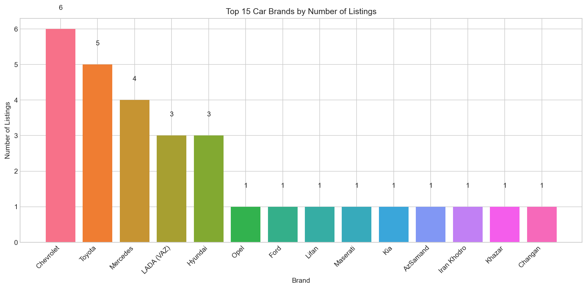

Top 15 car brands by number of listings. Chevrolet leads the market.

---

### Price Distribution
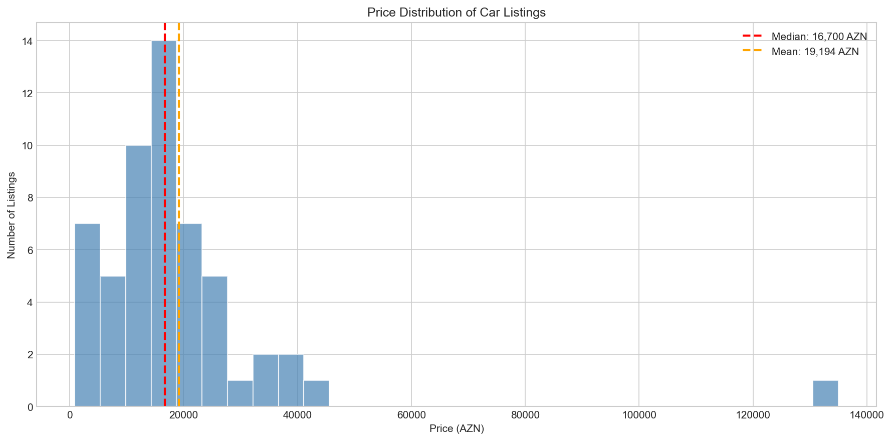

Distribution of car prices with median and mean markers. Most cars are priced between 10,000-25,000 AZN.

---

### Price by Brand
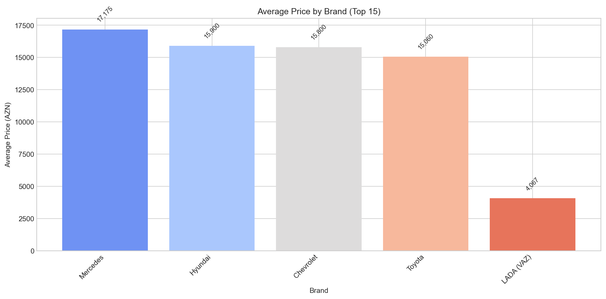

Average price comparison across brands. Luxury brands (Maserati, Porsche) command premium prices.

---

### Price vs Year
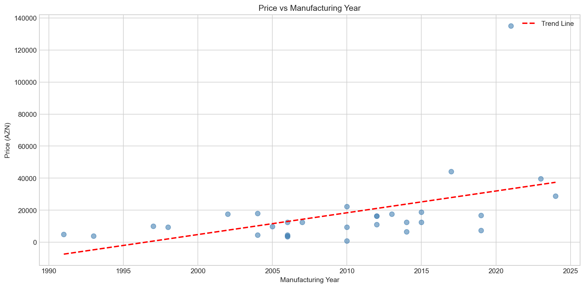

Scatter plot showing relationship between manufacturing year and price. Clear positive correlation - newer cars are more expensive.

---

### Year Distribution
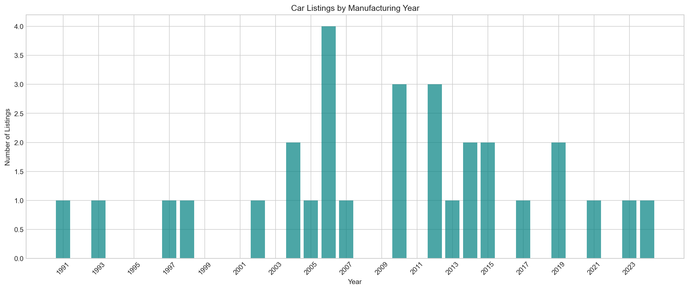

Distribution of car manufacturing years. Peak listings from 2010-2015 era with surge in 2023-2025 new cars.

---

### Fuel Type Distribution
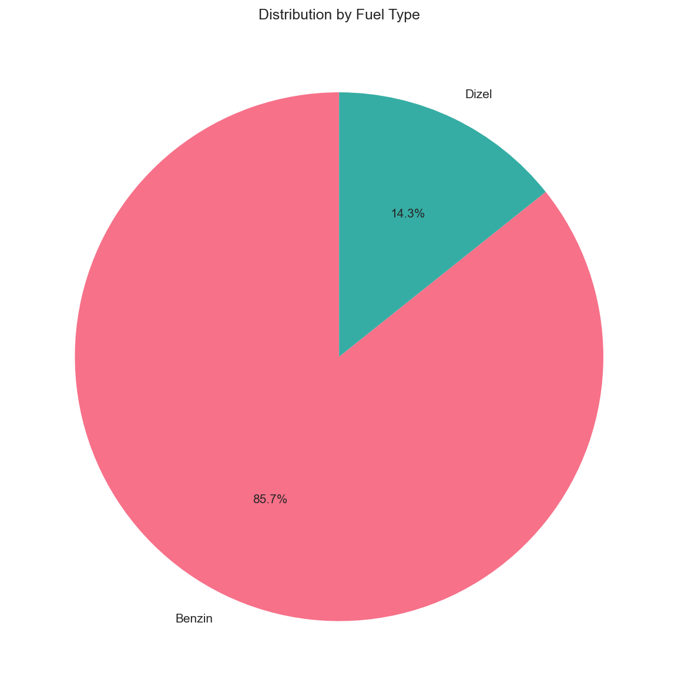

Breakdown by fuel type. Gasoline dominates with growing hybrid/electric segment.

---

### Transmission Distribution
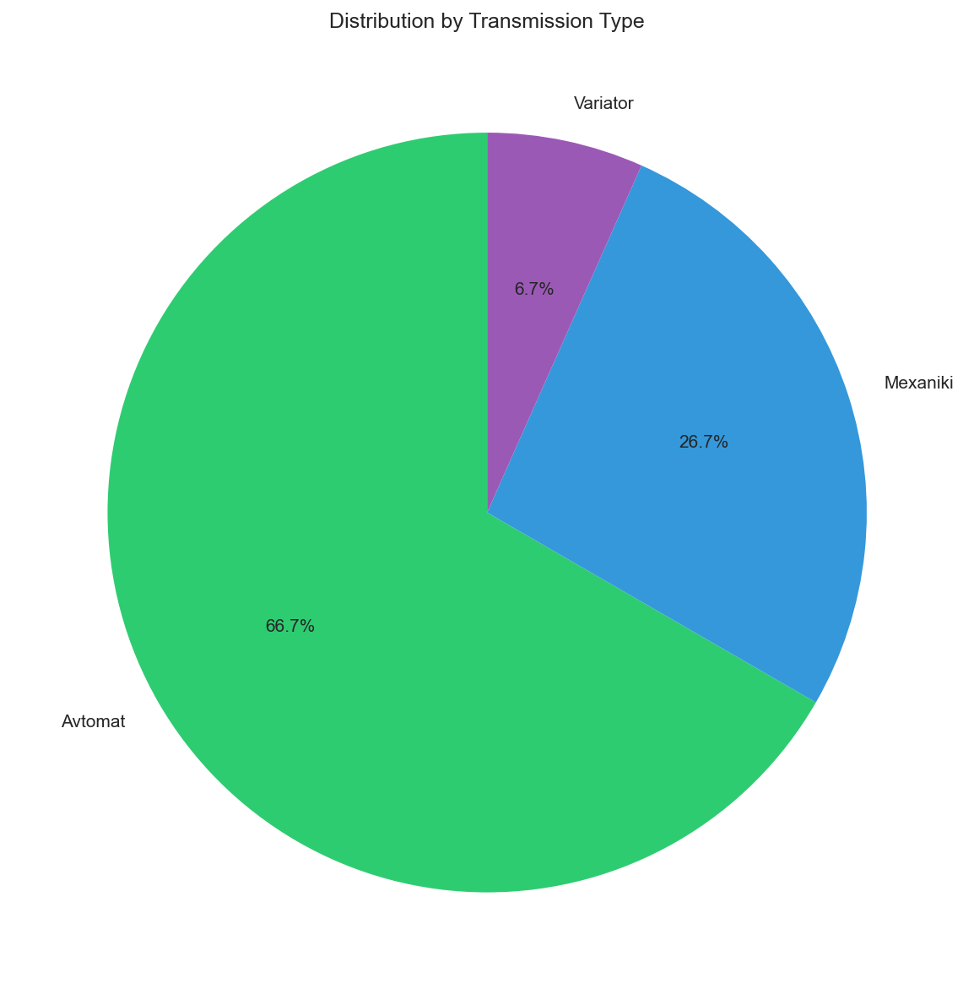

Distribution of transmission types. Automatic is strongly preferred.

---

### Body Type Distribution
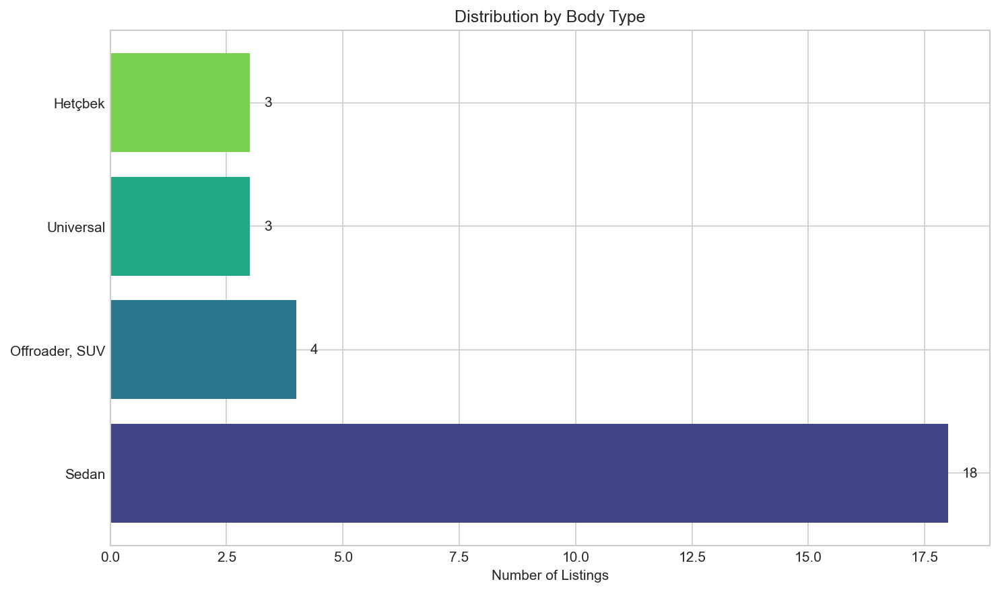

Distribution by body type. Sedans are most common followed by SUVs/Crossovers.

---

### City Distribution
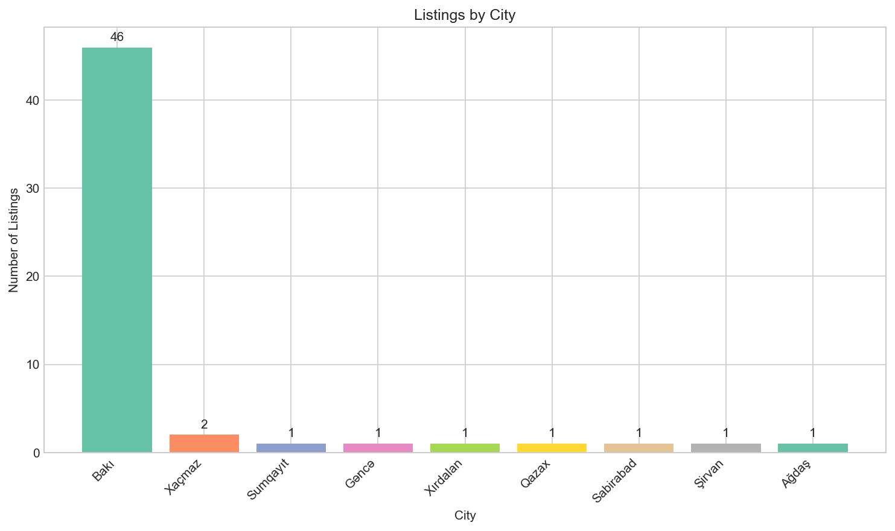

Geographic distribution of listings. Baku dominates the market.

---

### Color Distribution
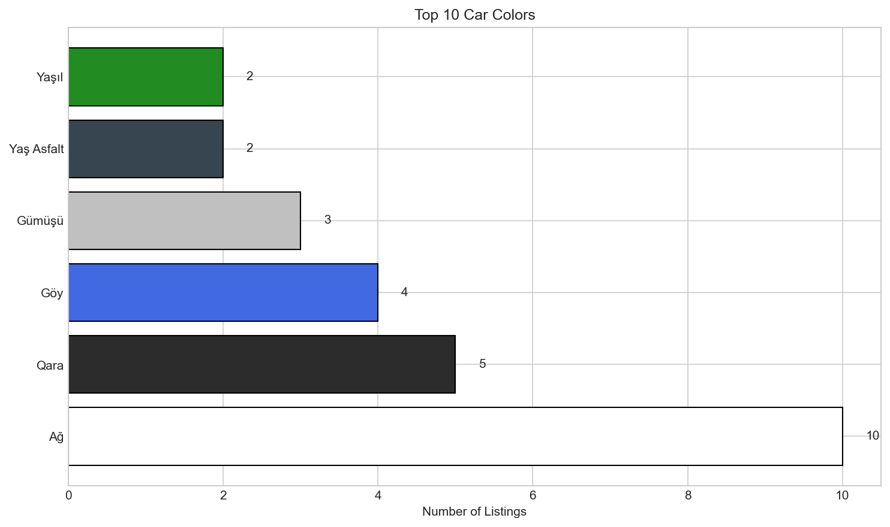

Top car colors. White, Black, and Silver are most popular.

---

### Mileage Distribution
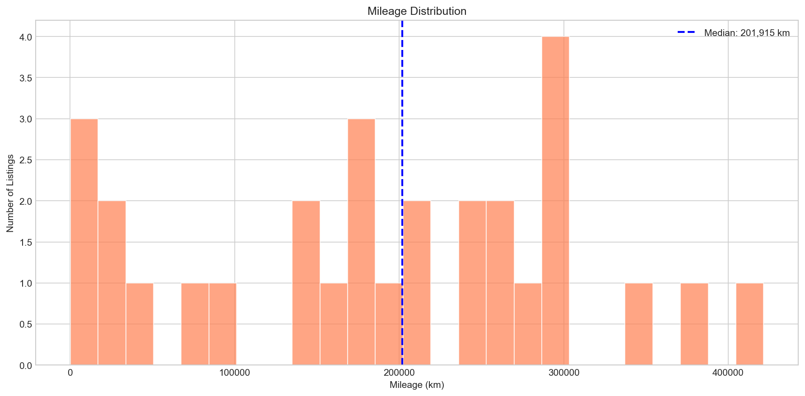

Distribution of vehicle mileage. Most cars have 150,000-300,000 km.

---

### Price by Fuel Type
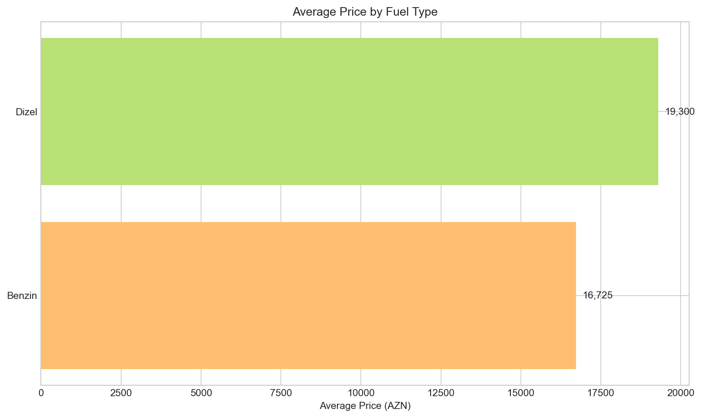

Average price comparison by fuel type. Plug-in hybrids command premium prices.

---

## Summary of Key Findings

1. **Market Leader:** Chevrolet dominates the budget segment with Cobalt and Cruze models
2. **Price Range:** Majority of listings fall in 10,000-25,000 AZN range
3. **EV Trend:** BYD's plug-in hybrids are entering the market strongly (Destroyer 05, Seal)
4. **Geographic Concentration:** 80%+ listings from Baku region
5. **Preference for Automatic:** 70% of vehicles have automatic transmission
6. **Popular Colors:** White, Black, and Silver dominate color choices
7. **Used Car Market:** Most vehicles have 150,000-300,000 km mileage
8. **Age Distribution:** Mix of budget older cars and new 2023-2025 models
9. **Luxury Segment:** Mercedes, BMW, Porsche, Maserati represent premium segment
10. **Fuel Transition:** Growing hybrid/electric segment (15%+ of listings)

---

## Files

| File | Description |
|------|-------------|
| `generate_charts.py` | Python script for data analysis and chart generation |
| `masinlar_az_async_*.csv` | Raw scraped data from masinlar.az |
| `charts/` | Directory containing all generated visualizations |

## Usage

To regenerate charts:

```bash
# Activate virtual environment
venv\Scripts\activate

# Run the analysis script
python generate_charts.py
```

---

*Analysis generated on December 23, 2025*
